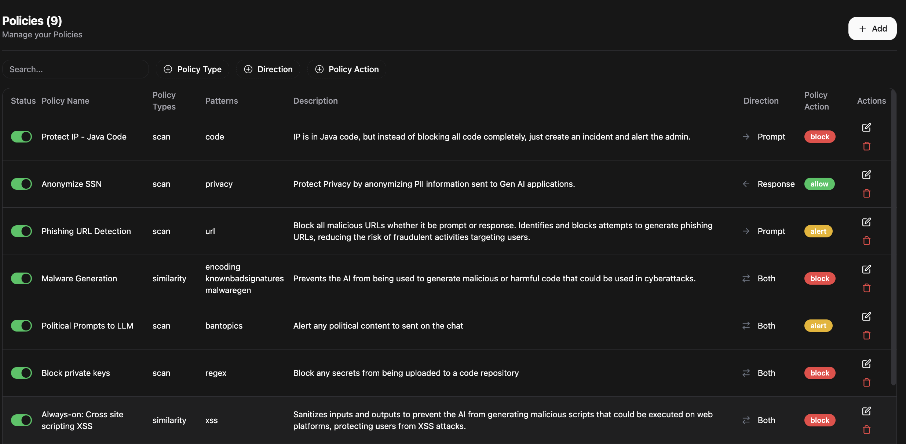
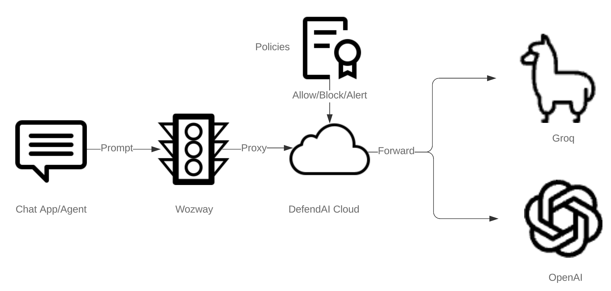

<p align="center"> 
  <br/>  
  <a href="https://opensource.org/license/apache-2-0"></a>
  <a href="https://discord.com/invite/NBgaCkmJPR">
    
  </a>
  <a href="https://pypi.org/project/defendai-wozway">
    
  </a>
 <a href="https://docs.defendai.tech"></a>
  <br/>  
  <br/>   
</p>
<p align="center">

</p>
<h3 align="center">Easily control traffic between Apps and LLM using data security policies</h3>
<br/>
<a href="https://defendai.tech">

</a>
<br/>
<br/>
<br/>

Integrate quickly using existing openai compatible chat completions api by just changing base url
```python
import openai

api_key = "YOUR_OPENAI_KEY"
client = openai.OpenAI(api_key=api_key,base_url="https://dev.defendai.tech")
response = client.chat.completions.create(
    model="gpt-4o",
    messages=[
        {"role": "system", "content": "You are a helpful assistant."},
        {"role": "user", "content": "Is this valid SSN 123-45-6789 ?"}
    ],
    stream=False
)
print(response.choices[0].message["content"])
```
Easily Add policies to Block/Alert/Anonymize Prompts or Responses by App and LLM Model

```python 
from defendai_wozway import Wozway
import os
api_key = "YOUR_OPENAI_KEY"
client = Wozway.Client(api_key=api_key,base_url="https://dev.defendai.tech")
policies = [
    {
        "policy_type": "Compliance",
        "direction": "PROMPT",
        "attributes": ["PII", "GDPR"],
        "action": "ALERT",
        "model": "gpt-4o",
        "app": "CopilotApp"
    },
    {
        "policy_type": "Security",
        "direction": "PROMPT",
        "attributes": ["Malware", "Phishing"],
        "action": "BLOCK",
        "model": "deepseek-r1",
        "app": "Global"
    },
    {
        "policy_type": "Privacy",
        "direction": "RESPONSE",
        "attributes": ["SSN"],
        "action": "ANONYMIZE",
        "model": "claude-sonet-3.7",
        "app": "StockAgent"
    }
]
client.apply(policies)

```
This service allows developers to easily secure requests and responses between their chat apps and LLM cloud services like OpenAI, Groq, Gemini , Anthropic , Perplexity and more using policies through cloud driven UI or APIs available via the wozway sdk 

## Table of Contents

- [Introduction](#introduction)
- [Features](#features)
- [Architecture](#architecture)
- [Prerequisites](#prerequisites)
- [Installation](#installation)
- [Usage](#usage)
- [Developer SDK](#sdk-installation)
- [Provision Tenant Video](#installation-video)
- [UI Walkthrough Video](#ui-video-walkthrough) 
- [Support](#support)
- [License](#license)

## Introduction

Wozway by DefendAI provides a secure and efficient way to manage communication between your chat client applications and various LLM cloud services. By running a simple script, you can start a tenant that proxies your LLM requests and response through a policy driven llm proxy , adding an extra layer of security and abstraction. Each tenant gets a cloud domain with ability to control traffic through the service


## Features

- Secure proxying of requests to Multiple LLM Providers (OpenAI, Groq, etc.)
- Policy based enforcement using API or UI
- Support for Regex , Anonymization , Code , Phishing URL , Prompt and Response detection
- Similarity search with millions of malicious prompts database to block/alery admin
- Incident , Activities and Dashboard for monitoring usage across all Gen AI Apps

## Architecture
Wozway runs alongside client apps and intelligently re-routes only LLM bound traffic to DefendAI Cloud for policy enforcement and subsequent forward to LLM Providers like Open AI , Anthropic , Groq etc ..
All other traffic is routed without any interference to its intended destination ..
Wozway can intercept both prompt and response for running full security check 

<p align="center">

</p>

## Prerequisites

- **Python 3.7+**
- **pip** package manager
- API keys for the LLM services you intend to use (e.g., OpenAI or GROQ API key)
- Docker

## Installation

1. **Clone the repository**

   ```bash
   git clone https://github.com/Defend-AI-Tech-Inc/wozway.git
   cd wozway
   ```

2. **Install dependencies**

   ```bash
   pip install -r requirements.txt
   ```

## Usage

### Starting the Tenant

Run the following script to start your tenant:

```bash
python start_tenant.py
```

This script will ask few questions to setup the cloud account and domain . It will start local version of openwebui integrated with wozway to proxy all requests throught the cloud proxy to the LLM Provider . Prompt and Responses are intercepted based on policies configured in cloud console


## SDK Installation

The SDK can be installed with either *pip* package manager.

### PIP


```bash
pip install defendai-wozway
```

<!-- End SDK Installation [installation] -->

<!-- Start IDE Support [idesupport] -->

## SDK Example Usage

### Simple Getting Started Example

```python
from defendai_wozway import Wozway
import os

with Wozway(
    bearer_auth=os.getenv("WOZWAY_BEARER_AUTH", ""),
) as s:
    res = s.activities.get_activities()
    if res is not None:
       for activity in res:
          print(activity["prompt"])
      pass
```

Detailed SDK documentation can be found here [SDK Documentation](sdk/README.md)

### Installation Video 

[](https://www.youtube.com/watch?v=PZnHQ6zh5rQ)

## UI Video Walkthrough 

[](https://github.com/user-attachments/assets/f5b594f0-d4a4-4b79-a51c-fcf6ceee2a65)


## Support

If you encounter any issues or have questions, please open an issue on the [GitHub repository](https://github.com/DefendAI/defendai-cloud-proxy/issues) or contact our support team at [support@defendai.tech](mailto:support@defendai.tech).

## License

This project is licensed under the Apache 2.0 License - see the [LICENSE](LICENSE) file for details.
